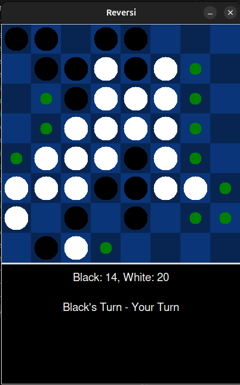
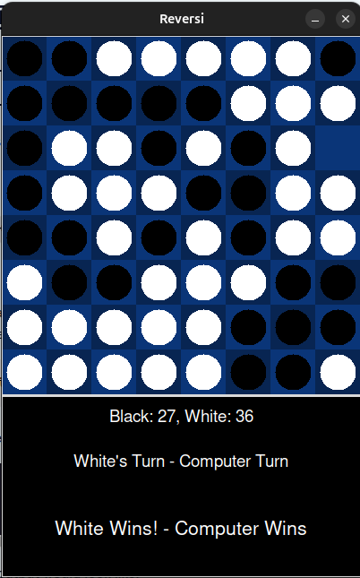

# Reversi
This Python program allows users to play the classic strategy board game called Reversi/Othello in a GUI against a computer that uses Minimax algorithm and Alpha-Beta Pruning to determine moves.

## Getting Started
Clone the repository and navigate into the project directory using the terminal.

If you dont already have Python 3 installed you can install it using this command:
`pip install python3`
No dependecies or libraries need to be installed to run the GUI since Tkinter is part of the Python standard library.

Then run the program using this command within the terminal:
`python3 reversi.py`

This will put you straight into a game against the computer.

## How to play

To win in Reversi, you need to have more pieces on the board than your opponent by the end of the game. There are black and white pieces. When the game ends, the person with the more pieces left on the board wins.

To capture pieces you must "flank them". Horizontally, diagonally, vertically capture opponents pieces that are inbetween your pieces.

For more info on specific rules go to: [Rules and Strategies](https://www.coolmathgames.com/blog/how-to-play-reversi-basics-and-best-strategies)

